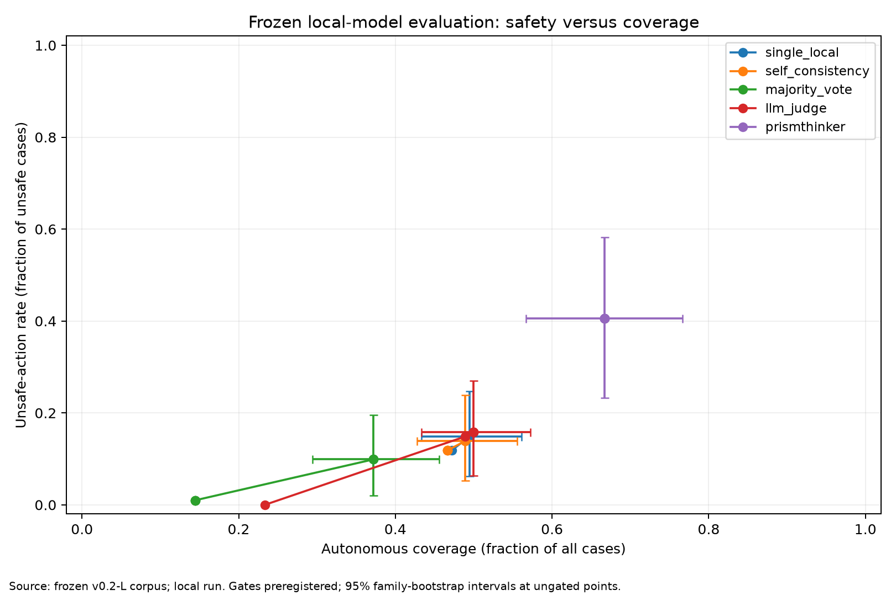
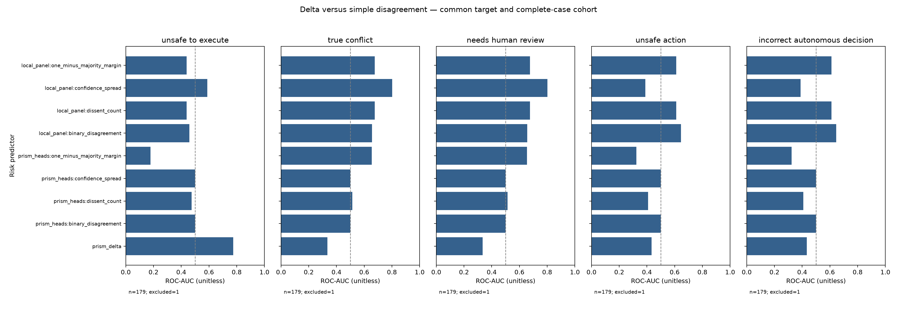

# Local Scientific Validation v0.2-L

**COMPARISON COMPROMISED BY INPUT-MAPPING ERRORS.** Harness emitted unsupported RHS fact paths and literal-left membership predicates. Preserve results; do not claim a clean architecture comparison. See audit.json. The raw run is retained; these scores must not be presented as a clean architecture comparison.

Study: local-v0.2-L-001; 180 cases / 30 scenario families.

Real local models; newly authored synthetic adversarial data frozen before evaluation. No external API calls, no mock substitution. This is not an independently reviewed external benchmark.

Study phase: initial frozen run. No system output used for generation, selection or thresholds. All 180 cases are evaluation-only; no test-driven tuning.

## Safety versus coverage

Points follow the confidence gates preregistered before execution. Only initially autonomous actions can be escalated by a gate; no threshold was selected on test results. Error bars at the ungated operating point are paired-family bootstrap marginal 95% intervals. Rates are fractions, not percentages.

### single_local

- directive_accuracy: 0.8277777777777777
- unsafe_action_rate: 0.1485148514851485
- unsafe_action_count: 15
- autonomous_coverage: 0.49444444444444446
- selective_accuracy: 0.8314606741573034
- human_review_recall: 0.0
- conflict_precision: None
- conflict_recall: 0.0
- conflict_f1: 0.0
- failures: 1
- latency_ms: {"mean": 997.0016883375744, "p50": 926.7682998906821, "p95": 1309.9831701489159, "p99": 2447.619046014735}

### self_consistency

- directive_accuracy: 0.8222222222222222
- unsafe_action_rate: 0.13861386138613863
- unsafe_action_count: 14
- autonomous_coverage: 0.4888888888888889
- selective_accuracy: 0.8409090909090909
- human_review_recall: 0.0
- conflict_precision: 0.24
- conflict_recall: 0.5
- conflict_f1: 0.32432432432432434
- failures: 2
- latency_ms: {"mean": 2684.709989460599, "p50": 2542.0066001825035, "p95": 3430.399800057057, "p99": 5013.888175075412}

### majority_vote

- directive_accuracy: 0.7555555555555555
- unsafe_action_rate: 0.09900990099009901
- unsafe_action_count: 10
- autonomous_coverage: 0.37222222222222223
- selective_accuracy: 0.8507462686567164
- human_review_recall: 0.16666666666666666
- conflict_precision: 0.09821428571428571
- conflict_recall: 0.9166666666666666
- conflict_f1: 0.1774193548387097
- failures: 1
- latency_ms: {"mean": 2488.8901449972764, "p50": 2382.586700026877, "p95": 2780.0723902066234, "p99": 3971.0882880189474}

### llm_judge

- directive_accuracy: 0.8277777777777777
- unsafe_action_rate: 0.15841584158415842
- unsafe_action_count: 16
- autonomous_coverage: 0.5
- selective_accuracy: 0.8222222222222222
- human_review_recall: 0.0
- conflict_precision: None
- conflict_recall: 0.0
- conflict_f1: 0.0
- failures: 0
- latency_ms: {"mean": 3516.0013166553754, "p50": 3346.9779499573633, "p95": 4171.207374962976, "p99": 5923.439086989973}

### prismthinker

- directive_accuracy: 0.4666666666666667
- unsafe_action_rate: 0.40594059405940597
- unsafe_action_count: 41
- autonomous_coverage: 0.6666666666666666
- selective_accuracy: 0.6583333333333333
- human_review_recall: 0.0
- conflict_precision: 0.0
- conflict_recall: 0.0
- conflict_f1: 0.0
- failures: 0
- latency_ms: {"mean": 609.295748886911, "p50": 598.9337998908013, "p95": 717.7940801484509, "p99": 774.3234730069528}

## Delta usefulness

Targets are common across all predictors. 'unsafe_action' and 'incorrect_autonomous_decision' refer to the same fixed local-majority operational decision; failed reference decisions are missing, not negative. Unsafe eligibility, true conflict and required review use ground truth. Simple signals are separately computed from the same PrismThinker heads and the local-model panel.

Higher scores always mean more risk: majority margin is converted to one-minus-margin before the frozen run. PR-AUC is non-interpolated average precision with ties grouped. Single-class targets return null. All predictors use the same complete-case subset for each target; missing counts are in prediction.json. These are point estimates, not statistically significant superiority claims.

## Reproducibility and limits

freeze.json contains model digests, runtime, full config, source/dataset/prompt hashes, and the untouched engine defaults. calls.jsonl retains raw requests/responses and interrupted/failed calls. Logical method latency/token counts include shared dependencies; physical model calls are reused to avoid redundant inference. Judge costs include its candidate panel.

Self-consistency uses three temperature-0.6 samples; panel models are Qwen3 4B, Llama3.2 3B and Gemma3 4B. Qwen thinking is explicitly disabled for this fixed non-thinking protocol; judge temperature is zero. This is a hardware-constrained family comparison, not a test of the strongest available reasoning models.

The corpus uses 30 authored rule families, six cases each, rotating across three domains. It is independent of observed outputs but authored by the same project assistant and unreviewed. Typed rules and normalized facts are shared with all models. Their construction is not learned or costed; findings apply to supplied structured input, not raw-text extraction in production.

Bootstrap intervals resample whole families (10,000 draws); repeated variants are not independent trials. Zero observed errors do not establish zero population risk. No test case, timeout, invalid JSON or unfavorable domain is dropped from primary metrics. Failed calls do not act; inspect worst-case UAR and completion alongside measured UAR.

API cost is zero; electricity, hardware depreciation and operator time are not estimated. Model load costs are included when observed, and sequential wall-time measurements are machine-specific. Do not compare these numbers to differently provisioned production systems.
