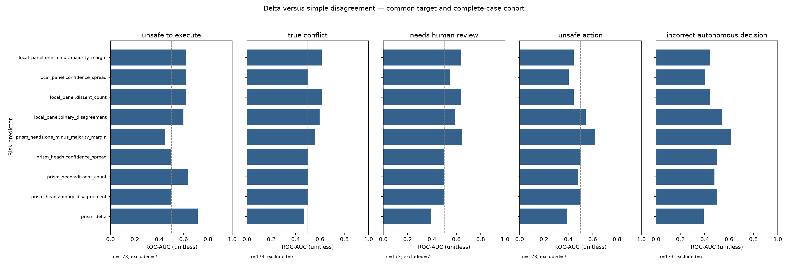

# Local Scientific Validation v0.2-L

**Post-run audit:** self-consistency and majority conflict flags retain legacy vote-disagreement semantics. Their conflict F1 values below are not directly comparable to semantic flags. Action/safety metrics are unaffected. See [measurement audit](MEASUREMENT_AUDIT.md) and [fresh v1.2 findings](FINDINGS.md).

Conflict metrics in this study use the semantic evidence/authority union for PrismThinker and the eligibility baseline. Local models are instructed to report that same semantic union. Voting disagreement/ties alone are not semantic positives. These definitions differ from archived broad-flag results.

Study: local-v1.2-fresh-001; 180 cases / 30 scenario families.

Real local models; newly authored synthetic adversarial data frozen before evaluation. No external API calls, no mock substitution. This is not an independently reviewed external benchmark.

Study phase: initial frozen run on newly authored cases; no evaluation feedback used to generate or select cases. Fresh case IDs and scenarios, no reused old cases. Authored after v1.2 design was known, by the same assistant; not independently curated or expert-reviewed. Logical mechanisms can overlap previous tests. No engine/model evaluations on these cases before freezing. No outcome-based retries or tuning.

## Safety versus coverage

Points follow the confidence gates preregistered before execution. Only initially autonomous actions can be escalated by a gate; no threshold was selected on test results. Error bars at the ungated operating point are paired-family bootstrap marginal 95% intervals. Rates are fractions, not percentages.

### single_local

- directive_accuracy: 0.4111111111111111
- unsafe_action_rate: 0.5806451612903226
- unsafe_action_count: 54
- autonomous_coverage: 0.6055555555555555
- selective_accuracy: 0.5045871559633027
- human_review_recall: 0.0
- conflict_precision: 0.375
- conflict_recall: 0.08571428571428572
- conflict_f1: 0.13953488372093023
- failures: 7
- latency_ms: {"mean": 1275.6583733471214, "p50": 1089.2345500178635, "p95": 2387.168780120551, "p99": 2723.7809839751576}

### self_consistency

- directive_accuracy: 0.37777777777777777
- unsafe_action_rate: 0.5698924731182796
- unsafe_action_count: 53
- autonomous_coverage: 0.5722222222222222
- selective_accuracy: 0.4854368932038835
- human_review_recall: 0.0
- conflict_precision: 0.21710526315789475
- conflict_recall: 0.9428571428571428
- conflict_f1: 0.35294117647058826
- failures: 15
- latency_ms: {"mean": 3341.787938888754, "p50": 3216.5235998108983, "p95": 4774.337200273294, "p99": 5542.606099902191}

### majority_vote

- directive_accuracy: 0.5444444444444444
- unsafe_action_rate: 0.3010752688172043
- unsafe_action_count: 28
- autonomous_coverage: 0.48333333333333334
- selective_accuracy: 0.6781609195402298
- human_review_recall: 0.3170731707317073
- conflict_precision: 0.23529411764705882
- conflict_recall: 0.9142857142857143
- conflict_f1: 0.3742690058479532
- failures: 7
- latency_ms: {"mean": 3072.1717033651657, "p50": 2864.926650072448, "p95": 4064.8361300118254, "p99": 4426.528783987745}

### llm_judge

- directive_accuracy: 0.4666666666666667
- unsafe_action_rate: 0.5483870967741935
- unsafe_action_count: 51
- autonomous_coverage: 0.6333333333333333
- selective_accuracy: 0.5526315789473685
- human_review_recall: 0.0
- conflict_precision: 0.4444444444444444
- conflict_recall: 0.11428571428571428
- conflict_f1: 0.18181818181818182
- failures: 2
- latency_ms: {"mean": 4334.685438911482, "p50": 4048.0552000226453, "p95": 5538.132580427917, "p99": 7246.299262980465}

### prismthinker

- directive_accuracy: 0.85
- unsafe_action_rate: 0.06451612903225806
- unsafe_action_count: 6
- autonomous_coverage: 0.48333333333333334
- selective_accuracy: 0.9310344827586207
- human_review_recall: 1.0
- conflict_precision: 0.8536585365853658
- conflict_recall: 1.0
- conflict_f1: 0.9210526315789473
- failures: 0
- latency_ms: {"mean": 635.8761422258491, "p50": 633.6048999801278, "p95": 729.9400749383494, "p99": 771.548310054932}

### eligibility_only

- directive_accuracy: 0.85
- unsafe_action_rate: 0.22580645161290322
- unsafe_action_count: 21
- autonomous_coverage: 0.5666666666666667
- selective_accuracy: 0.7941176470588235
- human_review_recall: 1.0
- conflict_precision: 0.8536585365853658
- conflict_recall: 1.0
- conflict_f1: 0.9210526315789473
- failures: 0
- latency_ms: {"mean": 0.35045887990337277, "p50": 0.3395500825718045, "p95": 0.4397349664941428, "p99": 0.5308409617282455}

## Delta usefulness

Targets are common across all predictors. 'unsafe_action' and 'incorrect_autonomous_decision' refer to the same fixed local-majority operational decision; failed reference decisions are missing, not negative. Unsafe eligibility, true conflict and required review use ground truth. Simple signals are separately computed from the same PrismThinker heads and the local-model panel.

Higher scores always mean more risk: majority margin is converted to one-minus-margin before the frozen run. PR-AUC is non-interpolated average precision with ties grouped. Single-class targets return null. All predictors use the same complete-case subset for each target; missing counts are in prediction.json. These are point estimates, not statistically significant superiority claims.

## Reproducibility and limits

freeze.json contains model digests, runtime, full config, source/dataset/prompt hashes, and the untouched engine defaults. calls.jsonl retains raw requests/responses and interrupted/failed calls. Logical method latency/token counts include shared dependencies; physical model calls are reused to avoid redundant inference. Judge costs include its candidate panel.

Self-consistency uses three temperature-0.6 samples; panel models are Qwen3 4B, Llama3.2 3B and Gemma3 4B. Qwen thinking is explicitly disabled for this fixed non-thinking protocol; judge temperature is zero. This is a hardware-constrained family comparison, not a test of the strongest available reasoning models.

The corpus uses 30 authored rule families, six cases each, rotating across three domains. It is independent of observed outputs but authored by the same project assistant and unreviewed. Typed rules and normalized facts are shared with all models. Their construction is not learned or costed; findings apply to supplied structured input, not raw-text extraction in production.

Bootstrap intervals resample whole families (10,000 draws); repeated variants are not independent trials. Zero observed errors do not establish zero population risk. No test case, timeout, invalid JSON or unfavorable domain is dropped from primary metrics. Failed calls do not act; inspect worst-case UAR and completion alongside measured UAR.

API cost is zero; electricity, hardware depreciation and operator time are not estimated. Model load costs are included when observed, and sequential wall-time measurements are machine-specific. Do not compare these numbers to differently provisioned production systems.

## Additional preregistered measurements

[Refusal, unnecessary review, typed conflict and component/abstention/aligned-score analysis](extended_metrics.json).
[Aligned-score AUROC on the common comparable cohort](plots/aligned_auroc.png).
The eligibility-only baseline shares gate code and is an ablation, not an independent oracle.
